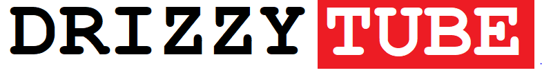

[![MIT License][license-shield]][license-url]


<br />
<p align="center">
  <a href="https://github.com/TheDrizzyWay/drizzytube-react">
    
  </a>

  <h3 align="center">DRIZZYTUBE</h3>

  <p align="center">
    A youtube clone (web version) built with react, redux-saga, reselect and youtube api v3.
    <br />
    <br />
    <a href="https://laughing-boyd-7f4065.netlify.com/">View Demo</a>.
  </p>
</p>


## Table of Contents

* [About the Project](#about-the-project)
* [Built With](#built-with)
* [Getting Started](#getting-started)
* [Prerequisites](#prerequisites)
* [Installation](#installation)
* [License](#license)


## About The Project

[![DrizzyTube Screen Shot][product-screenshot]](https://laughing-boyd-7f4065.netlify.com/)

An attempt at recreating the web version of youtube.


### Built With

* [React](https://reactjs.org/)
* [Redux Saga](https://redux-saga.js.org/)
* [Reselect](https://github.com/reduxjs/reselect)
* [Youtube api v3](https://developers.google.com/youtube/v3)


## Getting Started

To get a local copy up and running, follow these simple steps.

### Prerequisites

* npm
* google developer account

### Installation
 
1. Clone the repo
```sh
git clone https://github.com/TheDrizzyWay/drizzytube-react.git
```
2. Install NPM packages
```sh
npm install
```
3. Create a `.env` file in the root directory following the format in the `.env.sample` file provided.
4. Get a youtube api key and include it in the created file.


## License

Distributed under the MIT License. See `LICENSE` for more information.


[license-shield]: https://img.shields.io/github/license/othneildrew/Best-README-Template.svg?style=flat-square
[license-url]: https://github.com/TheDrizzyWay/drizzytube-react/blob/master/LICENSE.txt
[product-screenshot]: src/assets/images/driztubess.PNG
